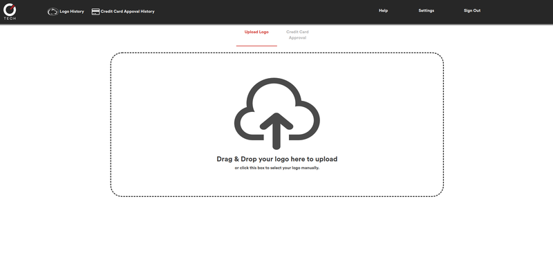

# Machine Learning @ Capital One
[](https://travis-ci.com/samlehman617/capstone)
[](http://hits.dwyl.io/samlehman617/samlehman617/capstone)

#### Authors: 
* [Sam Lehman](https://github.com/samlehman617)
* [John Barczynski](https://github.com/john-barczynski)
* [Kyle Eckenstine](https://github.com/eckenstine)
* [Mayank Makwana](https://github.com/mayankmmmx)
* [Sushrut Shringarputale](https://github.com/sushshring)
* Kyle Johnson
* Tyler Abbatico


## Overview:

Capital One continues to emerge in technology while providing financial services to customers. We continuously look for opportunities to enhance on existing technology by introducing new ideas and frameworks. Recently, Capital One has turned a major focus to Machine Learning (ML). By investing heavily in ML, Capital One plans to create extremely accurate models to predict behavior, helping us become more efficient, accurate, and secure. We are continuously looking for ways to incorporate ML in our ecosystem.

This repository contains the code for our Capstone project created as a part of the CMPSC 483 course at The Pennsylvania State University. Our project is focused on machine learning and presenting insights in a useful and friendly way. We acheived this through two main sub-projects implemented using Keras in Python for Machine Learning, Java Spring Framework, and React. 

#### Part 1: Penn State Logo Recognizer

The first sub-project, a Penn State logo recognizer gave the project team the opportunity to familiarize themselves with the concepts of machine learning and the frameworks chosen for the project. This tool takes in an image and outputs whether the system thinks the image is a Penn State logo or not.

#### Part 2: Credit Card Application Approval Tool
The second sub-project, a credit card approval classifier tool, applied the skills gained during the logo recognizer task to create a prototype for a system that could be potentially used at companies like Capital One to accept or reject credit card applications. This tool takes in relevant data such as an applicant's credit score and history and outputs a decision to accept or reject the applicant.

#### Demo:
The deployed version of this project can be viewed at: 

* [https://samlehman.me/capstone/](https://samlehman.me/capstone)

* [http://aws-website-john-2jt3q.s3-website-us-east-1.amazonaws.com/](http://aws-website-john-2jt3q.s3-website-us-east-1.amazonaws.com/)

* [https://d594x6z5780w4.cloudfront.net](https://d594x6z5780w4.cloudfront.net)?


## Frontend:



The frontend of the system is a [React](https://reactjs.org/) project using several common components, such as [React-Router](https://github.com/ReactTraining/react-router) and [React Dropzone](https://github.com/react-dropzone/react-dropzone) for  various effects. This system can be run locally using the [node package manager (NPM)](https://www.npmjs.com/).

### Installation

React and all of its components are managed by the node package manager (NPM). In order to install NPM onto your system, please see the [link on npm's website](https://www.npmjs.com/get-npm?utm_source=house&utm_medium=homepage&utm_campaign=free%20orgs&utm_term=Install%20npm).

All other component installation will be handled by NPM:

```bash
cd frontend
npm install
```

### Execution

All other components are installed by npm:

```bash
cd frontend
npm start
```

## Java API:

The Java API is implemented using the [Java Spring Framework](https://projects.spring.io/spring-framework/) using [Speedment](https://www.speedment.com/) to interface with the database. This backend API receives requests from the React frontend, authenticates users (*in progress*), handles all database operations, and serves as middleware for all communication with the Python ML models.

### Installation

Running this project requires [Java](https://java.com/) and the [Maven](https://maven.apache.org/) software management tool. These are the only two things that must be explicitly installed in order to run the Java API locally.

All other components are installed by Maven:

```bash
cd api
mvn clean install
```

### Execution

Installation and Build of all other components are handled by Maven. The Java API relies on the use of seven environment variables for storage of database and AWS credentials. Please contact a member of the production time for their values. These variables are: <br />


|        Variable       |                        Description                       |
|:---------------------:|:--------------------------------------------------------:|
| RDS_DB_NAME_CAP       | The name of the relational database used by the Java API |
| RDS_USERNAME          | The username of the relational database system           |
| RDS_PASSWORD          | The password of the RDS system                           |
| RDS_HOSTNAME          | The RDS hostname                                         |
| RDS_PORT              | The port at which to access the RDS                      |
| AWS_ACCESS_KEY_ID     | Amazon Web Services AccessID                             |
| AWS_SECRET_ACCESS_KEY | Amazon Web Services Access Key                           |

Once these variables have been set, running the server is as easy as starting spring:

```bash
cd api
mvn spring-boot:start
```


## Python ML:

The Python ML models convert input data (images and credit card information) into boolean answers within some level of confidence, returning that level of confidence to the caller. The interface between the Java API and the Python ML models is handled by a lightweight [Flask](http://flask.pocoo.org/) API.

### Installation

All major Python components can be installed using [Pip](https://pypi.python.org/pypi/pip), Python's package index. In order to prevent future versioning conflicts, it is recommended that you install the project components within a Python virtual environment.

```bash
pip install -r ml_backend/ml_backend/requirements.txt
pip install sklearn
```

### Execution

The flask CLI tool requires that the name of the flask app be provided as an environment variable. <br />


|        Variable       |                   Description                  |
|:---------------------:|:----------------------------------------------:|
| FLASK_APP             | The name of the Flask App that needs to be run |

To run the ML service locally using (*pre-compiled* weights), simply start flask:

```bash
flask run
```

To run the training model for images, create a dataset in images/training and a validation set in images/validation and run imageml.py. **This will, by default, overwrite the ML weights currently saved in first_try.h5. Be careful what you commit to the repository.**
